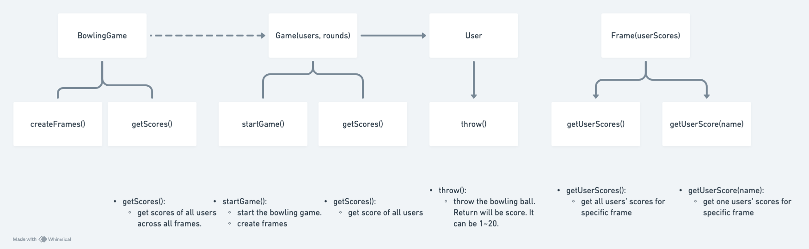

## Bowling Game

- [x] Create classes
- [x] Create methods
- [x] Write test code
- [x] Draw diagram by tool and attach as image in Readme
- [ ] Implement Game class
- [ ] How will Frame class work?
- [ ] Implement Frame class

## Class Diagram

